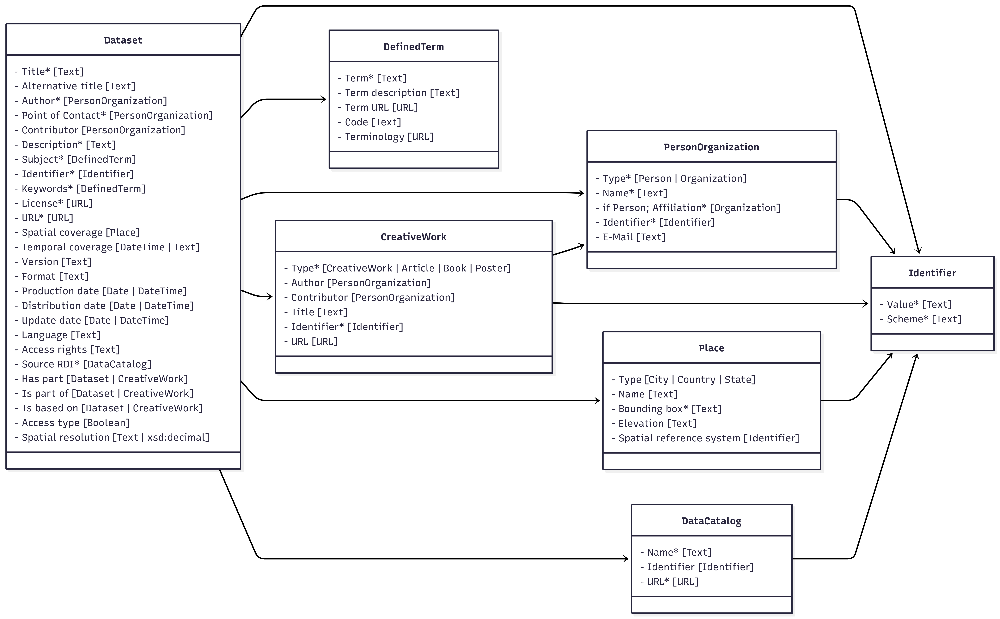
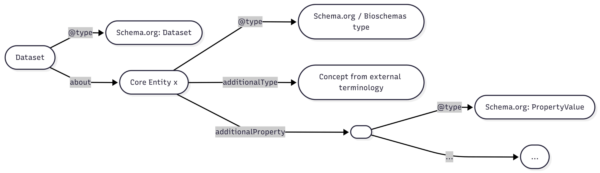
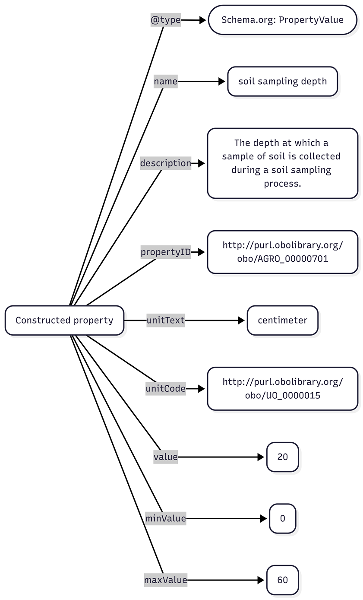

# FAIRagro Core Metadata Specification
Version 1.0
##  1. Introduction and motivation
FAIRagro offers a metadata framework for publishing research datasets in the agrosystem domain and is meant to be implemented in data publication services such as Research Data Infrastructures (RDIs) and data repositories.

For generic metadata, the Publication Metadata Set builds on Schema.org and other standards ([DC Terms](https://www.dublincore.org/specifications/dublin-core/dcmi-terms/), [DCAT](https://www.w3.org/TR/vocab-dcat-3/)) and combines these to define a set of types, properties and cardinalities and links between the types. 

Domain specific metadata is expressed through the Agrischemas framework. It additionaly builds on [Bioschemas](https://bioschemas.org/) to add agricultural related information to [Dataset](https://schema.org/Dataset) metadata with a focus on increasing its findability. It uses existing [types](https://bioschemas.org/types/) and [properties](https://schema.org/Property) and recommends semantic concepts to achieve interoperability. It can be implemented in already existing Schema.org interfaces by mapping domain-specific information available in local data/metadata to structures described in this document. **Agrischemas offers a list of recommended types and properties for findability based on this approach.**

These two components of FAIRagros metadata approach define a Core Metadata Specification to make required information available for FAIRagro services such as the [FAIRagro Search Hub](https://search-hub.fairagro.net/) which is based on [Dataverse](https://dataverse.org/). The Core Metadata Specification is harmonized with existing generic metadata standards as well as ongoing [NFDI](https://www.nfdi.de/) wide developments.

##  2. Publication Metadata Set

**Figure 1:** FAIRagros Publication Metadata Set types and their relations to each other. Mandatory properties of each type are marked with a "*".

Cardinalities are defined in relation to their respective concepts. 
<br>**Example:** A cardinality of "1" for a property does only apply, if an instance of its related concept exists. This doesn’t necessitate the existence of such an instance.

Types and properties from following namespaces are used:
<ul>
<li>Schema.org: https://schema.org/</li>
<li>DC Terms: http://purl.org/dc/terms/</li>
<li>DCAT: http://www.w3.org/ns/dcat#</li>
</ul>


### 2.1 Dataset

**Definition:** "A body of structured information describing some topic(s) of interest."

**Representation:**
```
{
	"@type": "https://schema.org/Dataset"
}
```

#### 2.1.1 Title
**Definition:** "The main title of the Dataset." (Definition taken from Dataverse)
<br>**Cardinality:** 1
<br>**Range:** Text

**Representation:**
```
{
	"https://schema.org/name": "Example title"
}
```

#### 2.1.2 Alternative title
**Definition:** "Either 1) a title commonly used to refer to the Dataset or 2) an abbreviation of the main title.” (taken from DataVerse)." (Definition taken from Dataverse)
<br>**Cardinality:** 0-n
<br>**Range:** Text

**Representation:**
```
{
	"https://schema.org/alternativeHeadline": "An alternative title"
}
```
#### 2.1.3 Author
**Definition:** "The entity, e.g. a person or organization, that created the Dataset." (Definition taken from Dataverse)
<br>**Cardinality:** 1-n
<br>**Range:** Person/Organization

**Representation:**
```
{
  "https://schema.org/author": [
    {
      "@type": "https://schema.org/Person"
    }
  ]
}
```
/
```
{
  "https://schema.org/author": [
    {
      "@type": "https://schema.org/Organization"
    }
  ]
}
```

#### 2.1.4 Point of Contact
**Definition:** "The entity, e.g. a person or organization, that users of the Dataset can contact with questions." (Definition taken from Dataverse)
<br>**Cardinality:** 1-n
<br>**Range:** Person/Organization
<br>**Comment:**  [Schema.org](http://schema.org) doesn’t offer a fitting property or type to express this role. The [https://schema.org/ContactPoint](https://schema.org/ContactPoint) type and its related [https://schema.org/contactPoint](https://schema.org/contactPoint) are meant to express a contact point for a person/organization, not to express a person/organization as a contact point, as it is defined in Dataverse. To still model this information, at least one person/organization related to a Dataset as an author or contributor, needs to be additionally typed by adding an [https://schema.org/additionalType](https://schema.org/additionalType) property with the value "Contact Point" to the person/organization metadata object.

**Representation:**
```
{
	"@type":"https://schema.org/Person",
	"https://schema.org/additionalType": "Contact Point"
}
```
/
```
{
  "@type": "https://schema.org/Organization",
  "https://schema.org/additionalType": "Contact Point"
}
```

#### 2.1.5 Contributor
**Definition:** "The entity, such as a person or organization, responsible for collecting, managing, or otherwise contributing to the development of the Dataset." (Definition taken from Dataverse)
<br>**Cardinality:** 0-n
<br>**Range:** Person/Organization

**Representation:**
```
{
  "https://schema.org/contributor": {
    "@type": "https://schema.org/Person"
  }
}
```
/
```
{
  "https://schema.org/contributor": {
    "@type": "https://schema.org/Organization"
  }
}
```

#### 2.1.6 Description
**Definition:** "A summary describing the purpose, nature, and scope of the Dataset." (Definition taken from Dataverse)
<br>**Cardinality:** 1-n
<br>**Range:** Text

**Representation:**
```
{
  "https://schema.org/description": "An example description"
}
```
#### 2.1.7 Subject
**Definition:** "The area of study relevant to the Dataset." (Definition taken from Dataverse)
<br>**Cardinality:** 1-n
<br>**Range:** DefinedTerm
<br>**Comment:** Dataverse uses a fixed list of subjects it accepts. For the agricultural domain, everything would fall under "Agricultural Sciences". To express this information use [https://schema.org/about](https://schema.org/about), link it to a [https://schema.org/DefinedTerm](https://schema.org/DefinedTerm) instance and use AGROVOCs "agricultural sciences" concept ([http://aims.fao.org/aos/agrovoc/c_49876](http://aims.fao.org/aos/agrovoc/c_49876)) for its value.

**Representation:**
```
{
  "https://schema.org/about": {
    "@type": "https://schema.org/DefinedTerm",
    "https://schema.org/name": "agricultural sciences",
		"https://schema.org/description": "Agricultural science is a broad multidisciplinary field of biology that encompasses the parts of exact, natural, economic and social sciences that are used in the practice and understanding of agriculture.",
		"https://schema.org/url":"http://aims.fao.org/aos/agrovoc/c_49876",
		"https://schema.org/termCode":"c_49876",
		"https://schema.org/inDefinedTermSet": "http://aims.fao.org/aos/agrovoc"
  }
}
```

#### 2.1.8 Identifier
**Definition:** "A unique identifier for the Dataset (e.g. producer's or repository's identifier)." (changed from DataVerse "otherId" definition)
<br>**Cardinality:** 1-n
<br>**Range:** Identifier
<br>**Comment:** This property is used to store the identifiers from original data sources such as Research Data Infrastructures. Compared to Dataverses "otherId" property, it is mandatory for the FAIRagro Publication Metadata Set.

**Representation:**
```
{
  "https://schema.org/identifier": {
    "@type": "https://schema.org/PropertyValue"
  }
}
```
#### 2.1.9 Keyword(s)
**Definition:** "A key term that describes an important aspect of the Dataset and information about any controlled vocabulary used." (Definition taken from Dataverse)
<br>**Cardinality:** 1-n
<br>**Range:** DefinedTerm

**Representation:**
```
{
  "https://schema.org/keywords": {
    "@type": "https://schema.org/DefinedTerm"
  }
}
```

#### 2.1.10 License
**Definition:** "License defining the rights to (re-)use the dataset." (Definition taken from Dataverse)
<br>**Cardinality:** 1
<br>**Range:** URL
<br>**Comment:** If possible, the "License" property should link to a record from the SPDX license list ([https://spdx.org/licenses/](https://spdx.org/licenses/)), a record from the Creative Commons license list ([https://creativecommons.org/share-your-work/cclicenses/](https://creativecommons.org/share-your-work/cclicenses/)) or to a separate ODRL compliant file.

**Representation:**
```
{
  "https://schema.org/license": "https://spdx.org/licenses/CC-BY-4.0.html"
}
```

#### 2.1.11 URL
**Definition:** "An URL where one can view or access the data in the Dataset, e.g. the webpage of a Research Data Infrastructure." (changed from DataVerse "alternativeURL")
<br>**Cardinality:** 1
<br>**Range:** URL

**Representation:**
```
{
  "https://schema.org/url": "https://www.openagrar.de/receive/openagrar_mods_00092233"
}
```

#### 2.1.12 Spatial coverage
**Definition:** "The spatialCoverage of a Dataset indicates the place(s) which are the focus of the content." (Definition changed from Schema.org "[https://schema.org/spatialCoverage](https://schema.org/spatialCoverage)")
<br>**Cardinality:** 0-n
<br>**Range:** Place

**Representation:**
```
{
  "https://schema.org/spatialCoverage": {
    "@type": "https://schema.org/Place"
  }
}
```

#### 2.1.13 Temporal coverage
**Definition:** "The temporalCoverage of a Dataset indicates the period that the content applies to, i.e. that it describes, either as a DateTime or as a textual string indicating a time period in [ISO 8601 time interval format](https://en.wikipedia.org/wiki/ISO_8601#Time_intervals). Open-ended date ranges can be written with ".." in place of the end date. For example, "2015-11/.." indicates a range beginning in November 2015 and with no specified final date." (Definition changed from [https://schema.org/temporalCoverage](https://schema.org/temporalCoverage))
<br>**Cardinality:** 0-1
<br>**Range:** Text / DateTime

**Representation:**
```
{
  "https://schema.org/temporalCoverage": "2022 - 2023"
}
```
#### 2.1.14 Version
**Definition:** "The version number of the dataset."
<br>**Cardinality:** 0-1
<br>**Range:** Text

**Representation:**
```
{
  "https://schema.org/version": "v1.0"
}
```

#### 2.1.15 Format
**Definition:** "The file format(s) of the dataset."
<br>**Cardinality:** 0-n
<br>**Range:** Text

**Representation:**
```
{
  "https://schema.org/encodingFormat": "application/zip"
}
```

#### 2.1.16 Production date
**Definition:** "The date when the data were produced (not distributed, published, or archived)." (Definition taken from Dataverse)
<br>**Cardinality:** 0-1
<br>**Range:** Date or DateTime (ISO 8601)

**Representation:**
```
{
  "https://schema.org/dateCreated": "2024-11-19"
}
```

#### 2.1.17 Distribution date
**Definition:** "The date when the Dataset was made available for distribution/presentation." (Definition taken from Dataverse)
<br>**Cardinality:** 0-1
<br>**Range:** Date or DateTime (ISO 8601)

**Representation:**
```
{
  "https://schema.org/datePublished": "2025-11-19"
}
```

#### 2.1.18 Update date
**Definition:** "The date on which the Dataset was most recently modified or when the item's entry was modified " (Definition changed from [https://schema.org/dateModified](https://schema.org/dateModified))
<br>**Cardinality:** 0-1
<br>**Range:** Date or DateTime (ISO 8601)

**Representation:**
```
{
  "https://schema.org/dateModified": "2025-11-19"
}
```

#### 2.1.19 Language
**Definition:** "A language that the Dataset's files is written in." (Definition taken from Dataverse)
<br>**Cardinality:** 0-n
<br>**Range:** Text
<br>**Comment:** Use language codes from [https://www.rfc-editor.org/info/bcp47](https://www.rfc-editor.org/info/bcp47).

**Representation:**
```
{
  "https://schema.org/inLanguage": "de-DE"
}
```

#### 2.1.20 Access rights
**Definition:** "Information about who accesses the resource or an indication of its security status." (taken from [http://purl.org/dc/terms/accessRights](http://purl.org/dc/terms/accessRights))
<br>**Cardinality:** 0-n
<br>**Range:** Text
<br>**Comment:** Values for access rights statements can e.g. be "restricted", or "internal" or can come from a controlled vocabulary.

**Representation:**
```
{
	"http://purl.org/dc/terms/accessRights":"internal"
}
```

#### 2.1.21 Source RDI
**Definition:** "The original Research Data Infrastructure that the dataset was published by."
<br>**Cardinality:** 1
<br>**Range:** DataCatalog

**Representation:**
```
{
  "https://schema.org/includedInDataCatalog": {
    "@type": "https://schema.org/DataCatalog"
  }
}
```

#### 2.1.22 Has part
**Definition:** "Indicates a Dataset or CreativeWork that is part of this item." (Definition changed from [https://schema.org/hasPart](https://schema.org/hasPart))
<br>**Cardinality:** 0-n
<br>**Range:** Dataset/CreativeWork

**Representation:**
```
{
  "https://schema.org/hasPart": {
    "@type": "https://schema.org/Dataset"
  }
}
```
/
```
{
  "https://schema.org/hasPart": {
    "@type": "https://schema.org/CreativeWork"
  }
}
```
#### 2.1.23 Is part of
**Definition:** "Indicates a Dataset or CreativeWork that this item." (Definition changed from [https://schema.org/isPartOf](https://schema.org/isPartOf))
<br>**Cardinality:** 0-n
<br>**Range:** Dataset/CreativeWork

**Representation:**
```
{
  "https://schema.org/isPartOf": {
    "@type": "https://schema.org/Dataset"
  }
}
```
/
```
{
  "https://schema.org/isPartOf": {
    "@type": "https://schema.org/CreativeWork"
  }
}
```

#### 2.1.24 Is based on
**Definition:** "A resource from which this Dataset is derived or from which it is a modification or adaptation. " (Definition changed from [https://schema.org/isBasedOn](https://schema.org/isBasedOn))
<br>**Cardinality:** 0-n
<br>**Range:** Dataset/CreativeWork

**Representation:**
```
{
  "https://schema.org/isBasedOn": {
    "@type": "https://schema.org/Dataset"
  }
}
```
/
```
{
  "https://schema.org/isBasedOn": {
    "@type": "https://schema.org/CreativeWork"
  }
}
```

#### 2.1.25 Access type
**Definition:** "A flag to signal that the item, event, or place is accessible for free." (Definition taken from [https://schema.org/isAccessibleForFree](https://schema.org/isAccessibleForFree))
<br>**Cardinality:** 0-1
<br>**Range:** Boolean

**Representation:**
```
{
  "https://schema.org/isAccessibleForFree": "True"
}
```
/
```
{
  "https://schema.org/isAccessibleForFree": "False"
}
```
#### 2.1.26 Spatial resolution
**Definition:** "Minimum spatial separation resolvable in a dataset, measured in meters." (Definition taken from DCAT)
<br>**Cardinality:** 0-1
<br>**Range:** Text / [xsd:decimal](https://www.w3.org/TR/xmlschema11-2/#decimal)

**Representation:**
```
{
	"https://www.w3.org/ns/dcat#spatialResolutionInMeters":"100.5"
}
```

### 2.2 Person/Organization
**Person definition:** A person (alive, dead, undead, or fictional). (Definition taken from [https://schema.org/Person](https://schema.org/Person))

**Organization definition:** An organization such as a school, NGO, corporation, club, etc. (Definition taken from [https://schema.org/Organization](https://schema.org/Organization))

#### 2.2.1 Type
**Definition:** "Defines if an entity is a person or an organization."
<br>**Cardinality:** 1
<br>**Range:**[https://schema.org/Person](https://schema.org/Person) / [https://schema.org/Organization](https://schema.org/Organization)
<br>**Comment**: Choosing the correct type depends on the property it is used for as a value. For the "author" property, it will most likely be a [https://schema.org/Person](https://schema.org/Person), whereas it will most likely be a [https://schema.org/Organization](https://schema.org/Organization) as a value for the "affiliation" property.


**Representation:**
```
{
  "@type": "https://schema.org/Person"
}
```
/
```
{
  "@type": "https://schema.org/Organization"
}
```

#### 2.2.2 Name
**Definition:** "The name of the person or the organization." (Definition changed from Dataverse)
<br>**Cardinality:** 1
<br>**Range:** Text

**Representation:**
```
{
  "https://schema.org/name": "Example name"
}
```
#### 2.2.3 Affiliation (Person)
**Definition:** "The name of the organization the person is  affiliated with, e.g. an organization's name." (Definition changed from Dataverse)
<br>**Cardinality:** 1
<br>**Range:** Text

**Representation:**
```
{
  "https://schema.org/affiliation": {
    "@type": "https://schema.org/Organization"
  }
}
```

#### 2.2.4 Identifier
**Definition:** "Uniquely identifies a person/organization when paired with an identifier type." (changed from DataVerse)
<br>**Cardinality:** 1
<br>**Range:** Identifier

**Representation:**
```
{
  "https://schema.org/identifier": {
    "@type": "https://schema.org/PropertyValue"
  }
}
```

#### 2.2.4 E-Mail
**Definition:** "A person/organization contact email address." (Definition changed from Dataverse)
<br>**Cardinality:** 0-1
<br>**Range:** Text

**Representation:**
```
{
  "https://schema.org/email": "email@example.org"
}
```

### 2.3 Identifier
**Definition:** A unique identifier of the an entity (e.g. a Dataset, a Person, an Organization) (Definition  changed from [https://www.w3.org/TR/vocab-dcat-3/#Property:resource_identifier](https://www.w3.org/TR/vocab-dcat-3/#Property:resource_identifier))

**Representation:**
```
{
  "@type": "https://schema.org/PropertyValue"
}
```
#### 2.3.1 Value
**Definition:** "The value of an identifier."
<br>**Cardinality:** 1
<br>**Range:** Text

**Representation:**
```
{
  "https://schema.org/value": "10.1000/182"
}
```

#### 2.3.2 Scheme
**Definition:** "The type of identifier (e.g. DOI, ORCID)." (Definition  changed from Dataverse)
<br>**Cardinality:** 1
<br>**Range:** Text / URL
<br>**Comment:** Use [https://schema.org/propertyID](https://schema.org/propertyID) to preferably point to a record in an identifier registry (e.g. [https://registry.identifiers.org/registry/orcid](https://registry.identifiers.org/registry/orcid)), the official namespace of an identifier (e.g. [https://orcid.org/](https://orcid.org/)) or provide a string value (e.g. "orcid").

**Representation:**
```
{
  "https://schema.org/propertyID": "https://registry.identifiers.org/registry/orcid"
}
```

### 2.4 DefinedTerm
**Definition:** "A word, name, acronym, phrase, etc. with a formal definition. Often used in the context of category or subject classification, glossaries or dictionaries, product or creative work types, etc." (Definition taken from [https://schema.org/DefinedTerm](https://schema.org/DefinedTerm))

**Representation:**
```
{
"@type": "https://schema.org/DefinedTerm"
}
```


#### 2.4.1 Term
**Definition:** "A key term that describes important aspects of the Dataset." (Definition taken from Dataverse)
<br>**Cardinality:** 1
<br>**Range:** Text

**Representation:**
```
{
  "https://schema.org/name": "An example defined term"
}
```
#### 2.4.2 Term description
**Definition:** "A description/definition of the DefinedTerm. " (Definition changed from [https://schema.org/description](https://schema.org/description))
<br>**Cardinality:** 0-1
<br>**Range:** Text

**Representation:**
```
{
  "https://schema.org/description": "Agriculture or farming is the cultivation and breeding of animals, plants and fungi for food, fiber, biofuel, medicinal plants and other products used to sustain and enhance human life."
}
```

#### 2.4.3 Term URL
**Definition:** "A URL that points to the web presence of the DefinedTerm" (Definition changed from Dataverse)
<br>**Cardinality:** 0-1
<br>**Range:** Text

**Representation:**
```
{
  "https://schema.org/url": "http://aims.fao.org/aos/agrovoc/c_203"
}
```

#### 2.4.4 Code
**Definition:** "A code that identifies a term within a terminology." (Definition changed from [https://schema.org/termCode](https://schema.org/termCode))"
<br>**Cardinality:** 0-1
<br>**Range:** Text

**Representation:**
```
{
  "https://schema.org/termCode": "c_203"
}
```

#### 2.4.5 Terminology
**Definition:** "The controlled vocabulary used for the keyword term (e.g. AGROVOC, GEMET)." (Definition changed from Dataverse)
<br>**Cardinality:** 0-1
<br>**Range:** URL

**Representation:**
```
{
  "https://schema.org/inDefinedTermSet": "http://aims.fao.org/aos/agrovoc"
}
```
### 2.5 DataCatalog
**Definition:** "A collection of datasets, e.g. a Research Data Infrastructure." (Definition changed from [https://schema.org/DataCatalog](https://schema.org/DataCatalog))

**Representation:**
```
{
  "@type": "https://schema.org/DataCatalog"
}
```

#### 2.5.1 Name
**Definition:** "The name of a Research Data Infrastructure/DataCatalog."
<br>**Cardinality:** 1
<br>**Range:** Text

**Representation:**
```
{
  "https://schema.org/name": "OpenAgrar"
}
```

#### 2.5.2 Identifier
**Definition:** "The Identifier of a Research Data Infrastructure/DataCatalog"
<br>**Cardinality:** 0-1
<br>**Range:** Identifier

**Representation:**
```
{
  "https://schema.org/identifier": {
    "@type": "https://schema.org/PropertyValue"
  }
}
```
#### 2.5.3 URL
**Definition:** "The URL of a Research Data Infrastructure/DataCatalog."
<br>**Cardinality:** 1
<br>**Range:** URL

**Representation:**
```
{
  "https://schema.org/url": "https://www.openagrar.de/"
}
```

### 2.6 CreativeWork
**Definition:** "The most generic kind of creative work, including books, movies, photographs, software programs, etc." (Definition taken from [https://schema.org/CreativeWork](https://schema.org/CreativeWork) )

#### 2.6.1 Type
**Definition:** "The specific type of a creative work (e.g. an article, book)."
<br>**Cardinality:** 1
<br>**Range:** [https://schema.org/CreativeWork](https://schema.org/CreativeWork); [https://schema.org/Article](https://schema.org/Article); [https://schema.org/Book](https://schema.org/Book); [https://schema.org/Poster](https://schema.org/Poster)

<br>**Comment:** Dataverse does not allow for the typisation of a related publication via a property, but [Schema.org](http://schema.org) does. [Schema.org](http://schema.org) offers different subtypes of [https://schema.org/CreativeWork](https://schema.org/CreativeWork). To guarantee consistent mapping to the correct fields in Dataverse this modeling via choosing a fitting type for the CreativeWork object in [Schema.org](http://schema.org) is necessary.

**Representation:**
```
{
  "@type": "https://schema.org/CreativeWork"
}
```
/
```
{
  "@type": "https://schema.org/Article"
}
```
/
```
{
  "@type": "https://schema.org/Book"
}
```
/
```
{
  "@type": "https://schema.org/Poster"
}
```

#### 2.6.2 Author
**Definition:** "The entity, e.g. a person or organization, that created the CreativeWork" (Definition changed from Dataverse)
<br>**Cardinality:** 0-n
<br>**Range:** Person/Organization

**Representation:**
```
{
  "https://schema.org/author": {
    "@type": "https://schema.org/Person"
  }
}
```
/
```
{
  "https://schema.org/author": {
    "@type": "https://schema.org/Organization"
  }
}
```

#### 2.6.3 Contributor
**Definition:** "The entity, such as a person or organization, responsible for collecting, managing, or otherwise contributing to the development of the CreativeWork" (Definition changed from Dataverse)
<br>**Cardinality:** 0-n
<br>**Range:** Person/Organization

**Representation:**
```
{
  "https://schema.org/contributor": {
    "@type": "https://schema.org/Person"
  }
}
```
/
```
{
  "https://schema.org/contributor": {
    "@type": "https://schema.org/Organization"
  }
}
```

#### 2.6.4 Title
**Definition:** "The main title of a creative work."
<br>**Cardinality:** 0-1
<br>**Range:** Text

**Representation:**
```
{
  "https://schema.org/name": "Example title"
}
```
#### 2.6.5 Identifier
**Definition:** "An identifier of a creative work."
<br>**Cardinality:** 1
<br>**Range:** Text

**Representation:**
```
{
  "https://schema.org/identifier": {
    "@type": "https://schema.org/PropertyValue"
  }
}
```
#### 2.6.6 URL
**Definition:** "An URL of a creative work."
<br>**Cardinality:** 0-1
<br>**Range:** Text

**Representation:**
```
{
  "https://schema.org/url": "https://zenodo.org/records/7528172"
}
```

### 2.7 Place
**Definition:** "Entities that have a somewhat fixed, physical extension." (Definition taken from [https://schema.org/Place](https://schema.org/Place))

#### 2.7.1 Type
**Definition:** "The specific type of a place (e.g. a city, country, state)."
<br>**Cardinality:** 0-1
<br>**Range:** [https://schema.org/City](https://schema.org/City); [https://schema.org/Country](https://schema.org/Country); [https://schema.org/State](https://schema.org/State)
<br>**Comment:** Dataverse doesn’t allow a typisation of different places, but [Schema.org](http://schema.org) does.  To guarantee consistent mapping to the correct fields in Dataverse (City, Country, State) this modeling via choosing a fitting type for the Place object in [Schema.org](http://schema.org) is necessary.

**Representation:**
```
{
  "@type": "https://schema.org/City"
}
```
/
```
{

"@type": "https://schema.org/Country"

}
```
/
```
{
  "@type": "https://schema.org/State"
}
```

#### 2.7.2 Name
**Definition:** "The name of a place."
<br>**Cardinality:** 0-1
<br>**Range:** Text

**Representation:**
```
{
  "https://schema.org/name": "Germany"
}
```

#### 2.7.3 Bounding box
**Definition:** "A box is the area enclosed by the rectangle formed by two points. The first point is the lower corner, the second point is the upper corner. A box is expressed as two points separated by a space character." (Definition taken from [https://schema.org/box](https://schema.org/box))
<br>**Cardinality:** 1
<br>**Range:** Text
<br>**Comment:** [Schema.org](http://schema.org) uses the [https://schema.org/GeoShape](https://schema.org/GeoShape) type to attach geospatial information to a Place object, via the [https://schema.org/geo](https://schema.org/geo) property. A bounding box can then be attached to this object.

**Representation:**
```
{
  "https://schema.org/geo": {
    "@type": "https://schema.org/GeoShape",
    "https://schema.org/box": "38.920952 -94.645443 38.951797 -94.680439"
  }
}
```
#### 2.7.4 Elevation
**Definition:** "Altitude, like elevation, is the distance above sea level."
<br>**Cardinality:** 0-1
<br>**Range:** Text

**Representation:**
```
{
  "https://schema.org/additionalProperty": {
    "@type": "https://schema.org/PropertyValue",
    "https://schema.org/name": "elevation",
    "https://schema.org/propertyID": "http://aims.fao.org/aos/agrovoc/c_316",
    "https://schema.org/unitText": "meter",
    "https://schema.org/unitCode": "http://purl.obolibrary.org/obo/UO_0000008",
    "https://schema.org/value": "65"
  }
}
```
#### 2.7.5 Spatial reference system
**Definition:** "The spatial reference system used for the measured geocoordinates."
<br>**Cardinality:** 0-1
<br>**Range:** Identifier
<br>**Comment:** For the value of a spatial reference system please use EPSG codes where possible.
**Representation:**
```
{
  "https://schema.org/additionalProperty": {
    "@type": "https://schema.org/PropertyValue",
    "https://schema.org/name": "spatial reference system",
    "https://schema.org/propertyID": "https://www.commoncoreontologies.org/ont00000275",
    "https://schema.org/value": "EPSG:4326"
  }
}
```

## 3. Agrischemas
### 3.1 Design principles and modeling conventions
Agrischemas aims at efficiently reusing established resources, only extending these where necessary. In general, the framework builds on following modeling conventions:<br>
- Agrischemas uses a set of existing Schema.org / [Bioschemas](https://bioschemas.org/types/) types to represent its core entities. The corresponding type for each core entity is listed in its chapter. Instances of the core entities are typed via the "@type" property.<br>
- Instances of the core entities are linked to [Dataset](https://schema.org/Dataset) via the [about](https://schema.org/about) property.<br>
- For semantic enrichment, instances of the core entities are further typed via the [additionalType](https://schema.org/additionalType) property, referencing specific semantic concepts.<br>
- Agrischemas makes use of the [additionalProperty](https://schema.org/additionalProperty) property in combination with the [PropertyValue](https://schema.org/PropertyValue) type to construct properties increasing the findability of datasets.<br>
- By using the [propertyID](https://schema.org/propertyID) property, these constructed properties are semantically enriched.<br>
- Where possible Agrischemas recommends the use of controlled vocabularies/terminologies for values of properties.<br>
- If the value of a property is more complex than a string, Agrischemas uses the [valueReference](https://schema.org/valueReference) to provide a link to a semantic concept for the value.<br>

An example metadata instance in Agrischemas could look like this:

**Figure 2:** General structure of domain specific metadata in a Dataset metadata instance in Agrischemas.

- For each property constructed via [additionalProperty](https://schema.org/additionalProperty), following properties are possibly used to define it:
	- [name](https://schema.org/name): The name of the property.
	- [description](https://schema.org/description): A description or definition of the property. This can be cited from terminologies or other semantic resources.
	- [propertyID](https://schema.org/propertyID): A reference to a semantic concept, e.g. a terminology class or property, that represents the property.
	- [unitText](https://schema.org/unitText): The unit a property is measured in as a string.
	- [unitCode](https://schema.org/unitCode): A reference to a semantic concept that represents the unit a property is measured in.
	- [value](https://schema.org/value): The value of a specific measurement of a property.
	- [minValue](https://schema.org/minValue): The minimum possible value of a specific measurement of a property.
	- [maxValue](https://schema.org/maxValue): The maximum possible value of a specific measurement of a property.
	- [valueReference](https://schema.org/valueReference): A secondary value that provides additional information on the original value, e.g. a reference temperature or a type of measurement.


**Figure 3:** Soil sampling depth as an example for a constructed property.

### 3.2. Crop
**Definition:** Plants cultivated for food, fiber, livestock fodder or other uses, usually sown and harvested during a single agricultural year.<br>
	- [Definition source](http://aims.fao.org/aos/agrovoc/c_1972)<br>
- **Type:** [BioSample](https://bioschemas.org/BioSample)<br>
- **Additional type:** http://purl.obolibrary.org/obo/AGRO_00000325<br>

A crop entity represents a sample of a specific plant or group of plants, sharing the same [taxonomic species](http://aims.fao.org/aos/agrovoc/c_331243), that are described in a dataset.

Agrischemas recommends the following set of constructed properties to describe a crop entity:

|ID|name|description|propertyID|unitText|unitCode|minValue|maxValue|Controlled vocabulary|
|--|--|--|--|--|--|--|--|--|
|CR_001|species|A group of organisms of common ancestry having common characteristics, that are able to reproduce only among themselves to produce fertile offspring and which are usually geographically distinct. It constitutes the fundamental rank in the taxonomic hierarchy.|http://aims.fao.org/aos/agrovoc/c_331243|/|/|/|/|AGROVOC concepts with the "has taxonomic rank" property with a value of [species](https://agrovoc.fao.org/browse/agrovoc/en/page/c_331243)
|CR_002|variety|A plant grouping, within a single botanical taxon of the lowest known rank, defined by the reproducible expression of its distinguishing and other genetic characteristics. A formal rank in botanical taxonomic nomenclature|http://aims.fao.org/aos/agrovoc/c_1423211760123|/|/|/|/|/
|CR_003|sowing date|Date of sowing.|http://aims.fao.org/aos/agrovoc/c_16208|Date|https://schema.org/Date|/|/|/
|CR_004|harvesting date|Date of harvest.|http://aims.fao.org/aos/agrovoc/c_29464|Date|https://schema.org/Date|/|/|/

For expressing pheontypic traits, we recommend using traits from the [Crop Ontology](https://cropontology.org/). It collects traits for different species in separate ontologies. Please refer to the specific ontology relevant for the species you are describing and express each trait in the following structure:
```
{
  "@context": "https://bioschemas.org/",
  "@type": "Biosample",
  "additionalType": "http://aims.fao.org/aos/agrovoc/c_5993",
  "additionalProperty": [
    {
      "@type": "PropertyValue",
      "name": "Plant height",
      "propertyID": "https://cropontology.org/rdf/CO_321:0000020",
      "description": "Height of plant from ground to top of spike, excluding awns."
      "value":"110"
      "unitText":"centimeter",
      "unitCode":"http://purl.obolibrary.org/obo/UO_0000015"
    }
  ]
}				
```

### 3.3 Soil
 **Definition:** Upper layer of the earth in which plants grow.<br>
	- [Definition source](http://aims.fao.org/aos/agrovoc/c_7156)<br>
- **Type:** [Sample](https://bioschemas.org/Sample)<br>
- **Additional type:** http://aims.fao.org/aos/agrovoc/c_7156<br>

A soil entity represents a specific soil sample, that is described in a dataset, representative for a bigger unit of land.

Agrischemas recommends the following set of constructed properties to describe a soil sample:

|ID|name|description|propertyID|unitText|unitCode|minValue|maxValue|Controlled vocabulary|
|--|--|--|--|--|--|--|--|--|
|SO_001|soil texture|Soil texture (such as loam, sandy loam or clay) refers to the proportion of sand, silt and clay sized particles that make up the mineral fraction of the soil.|http://aims.fao.org/aos/agrovoc/c_7199|/|/|/|/|For USDA soil classification classes, use the following classes: [clay](https://lod.nal.usda.gov/nalt/26755), [silty clay](https://lod.nal.usda.gov/nalt/105830),[sandy clay](https://lod.nal.usda.gov/nalt/105829), [clay loam](https://lod.nal.usda.gov/nalt/26741), [silty clay loam](https://lod.nal.usda.gov/nalt/286875), [sandy clay loam](https://lod.nal.usda.gov/nalt/105828), [loam](https://lod.nal.usda.gov/nalt/50479), [silt loam](https://lod.nal.usda.gov/nalt/63100), [silt](https://lod.nal.usda.gov/nalt/63101), [sandy loam](https://lod.nal.usda.gov/nalt/62359), [loamy sand](https://lod.nal.usda.gov/nalt/105831), [sand](https://lod.nal.usda.gov/nalt/62360)
|SO_002|reference group|The World Reference Base (WRB) is an international system for classification of soils. It was designed to cater for any soil in the world. WRB has come forth from an initiative of FAO and UNESCO, supported by UNEP and the International Union of Soil Sciences (IUSS).|http://aims.fao.org/aos/agrovoc/c_89f35c33|/|/|/|/|Use subclasses of the AGROVOC ["World Reference Base soil types"](http://aims.fao.org/aos/agrovoc/c_89f35c33) class 
|SO_003|pH|Soil pH is a measure of the acidity or alkalinity of the soil. A pH value is actually a measure of hydrogen ion concentration. It is a ‘reverse’ scale in that a very acid soil has a low pH and a high hydrogen ion concentration.|http://aims.fao.org/aos/agrovoc/c_34901|/|http://purl.obolibrary.org/obo/UO_0000196|0|14|/
|SO_004|bulk density|A sufficiently large volume of soil containing a large number of pores, such that the concept of mean global properties is applicable.|http://aims.fao.org/aos/agrovoc/c_7167|g/cm3|http://purl.obolibrary.org/obo/UO_0000084|/|/|/
|SO_005|sampling depth|The depth at which a sample of soil is collected during a soil sampling process.|http://purl.obolibrary.org/obo/AGRO_00000701|centimeter|http://purl.obolibrary.org/obo/UO_0000015|/|/|/
|SO_006|available water content|Quantity of water present in the soil and usable by plants, classically defined as the difference between moisture at field capacity and moisture at wilting point.|http://opendata.inrae.fr/thesaurusINRAE/c_6446|milimeter|http://purl.obolibrary.org/obo/UO_0000016|/|/|/
|SO_007|organic carbon|Soil organic carbon (SOC) refers to the carbon held within the soil and is expressed as a percentage by weight (gC/Kg soil). Climatic shifts in temperature and precipitation have a major influence on the decomposition and amount of SOC stored within an ecosystem and that released into the atmosphere. Globally, the amount of carbon stored in soils is twice the amount that is stored in all terrestrial plants. Soil organic carbon (SOC) is essential for maintaining fertility, water retention, and plant production in terrestrial ecosystems. The amount of SOC stored within an ecosystem, is dependent on the quantity and quality of organic matter returned to the soil matrix, the soils ability to retain organic carbon (a function of texture and caption exchange capacity), and biotic influences of both temperature and precipitation. The global decline in SOC as a result of deforestation, shifting cultivation and arable cropping have made significant contributions to increased levels of atmospheric carbon dioxide (CO2).|http://aims.fao.org/aos/agrovoc/c_389fe908|gC/Kg|/|/|/|/
|SO_008|total carbon|Content or amount of total carbon in soil, including organic carbon and carbon from lime.|http://aims.fao.org/aos/agrovoc/c_24fb4269|/|/|/|/|
|SO_009|total nitrogen|Content or amount of total nitrogen in soil.|http://aims.fao.org/aos/agrovoc/c_bdc779f4|/|/|/|/|/

If you want to represent additional soil properties, we recommend using subclasses of the AGROVOC [soil properties](http://aims.fao.org/aos/agrovoc/c_330883) concept.

### 3.4 Plot
- **Definition:** An area of land, somehow related to a dataset, with a particular ownership, land use, or other characteristic.<br>
	 - [Definition source](http://aims.fao.org/aos/agrovoc/c_fdfbb37f)<br>
- **Type:** [Place](https://schema.org/Place)<br>
-  **Additional type:** http://aims.fao.org/aos/agrovoc/c_2894<br>

A plot entity represents a single plot that is somehow related to a dataset.

The following, existing properties are recommended to describe a plot:

|Property|Expected type|Description|Cardinality|Controlled Vocabulary|
|--|--|--|--|--|
|name|[Text](https://schema.org/Text)|The name of the place.|MANY|/
|geo|[GeoShape](https://schema.org/GeoShape)|The geo coordinates of the place.|MANY|/

- For **geo**: The geographical coordinates of a [Place](https://schema.org/Place) should be attached to it through a [GeoShape](https://schema.org/GeoShape) object by using the geo property. The [GeoShape](https://schema.org/GeoShape) type offers the [box](https://schema.org/box) property to attach a bounding box as a [Text](https://schema.org/Text) where the box is expressed as two points separated by a space character. The first point is the lower corner, the second point is the upper corner.

|ID|name|description|propertyID|unitText|unitCode|minValue|maxValue|Controlled vocabulary|
|--|--|--|--|--|--|--|--|--|
|PL_001|crop yield|The amount of plant crop (such as cereal, grain or legume) harvested per unit area for a given time.|http://aims.fao.org/aos/agrovoc/c_10176|dt/ha|/|/|/|/
|PL_002|elevation|Altitude, like elevation, is the distance above sea level.|http://aims.fao.org/aos/agrovoc/c_316|meter|http://purl.obolibrary.org/obo/UO_0000008|/|/|/
|PL_003|plot size|The size of a specific plot measured in m².|http://aims.fao.org/aos/agrovoc/c_2893|square meter|http://purl.obolibrary.org/obo/UO_0000080|/|/|/
|PL_004|spatial reference system|A spatial reference system (SRS) or coordinate reference system (CRS) is a framework used to precisely measure locations on the surface of Earth as coordinates.|https://www.commoncoreontologies.org/ont00000275|/|/|/|/|Please use [ESPG codes](https://epsg.io/), e.g. "EPSG:4326" for WGS 84, where possible 

### 3.5 Sensor
 - **Definition**: A device, somehow related to a dataset, that observes and measures a physical property of a natural phenomenon or man-made process and converts that measurement into a signal (chemical, electrical or other).<br>
	 - [Definition source](http://aims.fao.org/aos/agrovoc/c_28279)<br>
 - **Type:**[Product](https://schema.org/Product)<br>
 - **Additional type:** [Sensor](http://www.w3.org/ns/sosa/Sensor)<br>

A sensor entity represents a specific sensor, that is described in a dataset, or was used to create measurements in it.

The following, existing properties are recommended to describe a sensor:

|ID|name|description|propertyID|unitText|unitCode|minValue|maxValue|Controlled vocabulary|
|--|--|--|--|--|--|--|--|--|
|SE_001|is hosted by|Relation between a Sensor and the Platform that it is mounted on or hosted by.|https://www.w3.org/TR/vocab-ssn/#SOSAisHostedBy|/|/|/|/|
|SE_002|activity type|Describes if the sensor is an active or a passive sensor.|/|/|/|/|/|"Active" or "Passive"
|SE_003|sensor type|Describes what type of information the sensor measures.|/|/|/|/|/|<ul><li>[Radar](http://aims.fao.org/aos/agrovoc/c_24071)</li><li>[LiDAR](http://aims.fao.org/aos/agrovoc/c_c3ea7f1d)</li><li>[Optical sensor](http://aims.fao.org/aos/agrovoc/c_08dded27)</li><li>[Thermal Infrared Sensor](http://opendata.inrae.fr/thesaurusINRAE/c_17410)</li><li>Atmospheric sounder</li></ul>
|SE_004|band category|Describes if a sensor uses single, multi or hyper spectral bands.|/|/|/|/|/|<ul><li>single-band</li><li>multi-band</li><li>hyper-spectral</li><li> broadband</li></ul>
|SE_004|spectral band|Describes a specific spectral band of a sensor|/|/|/|/|/|/

### 3.6 Agricultural process
- **Definition**: A planned process which occurs in an agricultural field.<br>
	- [Definition source](http://purl.obolibrary.org/obo/AGRO_00002071)<br>
 - **Type:** [LabProcess](https://bioschemas.org/LabProcess)<br>
 - **Additional type:** [Agricultural process](http://purl.obolibrary.org/obo/AGRO_00002071)<br>

An agricultural process entity represents a specific agricultural process, that is described in a dataset, or was used was part of its creation.

To express an agricultural process, please create a  [LabProcess](https://bioschemas.org/LabProcess) object in the metadata instance and attach it to a [Dataset](https://schema.org/) object via the https://schema.org/about property. This describes a single execution of the process.
To describe the protocol that the process follows, please use the [LabProtocol](https://bioschemas.org/LabProtocol) type and attach it to a process via the [executesLabProtocol](https://bioschemas.org/types/LabProcess/0.1-DRAFT#executesLabProtocol) property. Link the [LabProtocol](https://bioschemas.org/LabProtocol) object to one of the recommended resources from this specificiation via the [intendedUse](https://bioschemas.org/types/LabProtocol/0.5-DRAFT#intendedUse) property:

Here you can find an example of the described structure:
```
{
  "@context": "https://schema.org/",
  "@type": "Dataset",
  "about": [
    {
      "@context": "https://bioschemas.org/",
      "@type": "LabProcess",
      "additionalType":"http://purl.obolibrary.org/obo/AGRO_00002071",
      "executesLabProtocol":
	      {
		      "@type": "LabProtocol",
		      "intendedUse":"http://purl.obolibrary.org/obo/AGRO_00020004"
		  }
    }
  ]
}
```
Use one of the following recommendations as a value for the intendedUse property, if you want to express one of the following standard agricultural processes:

|Process|References|
|--|--|
|Irrigation|<ul><li>For general irrigation processes please use http://purl.obolibrary.org/obo/AGRO_00000006</li><li>For more specific types of irrigation, please use one of its respective sub classes.</li></ul>|
|Tillage| <ul><li>For general tillage processes please use http://purl.obolibrary.org/obo/AGRO_01000015</li><li>For more specific types of tillage, please use one of its respective sub classes.</li></ul>|
|Pest control|<ul><li>For general pest control processes please use http://purl.obolibrary.org/obo/AGRO_00000023</li><li>For more specific types of pest control please its respective sub classes.</li></ul>
|Fertilizer application |<ul><li>For fertilizer application processes please use http://purl.obolibrary.org/obo/AGRO_01000000.</li></ul>

## 4. Examples
A full example metadata file for the Publication Metadata Set [can be found here](https://github.com/fairagro/core-metadata-specification/blob/main/exampleData/FAIRagro_Publication_Metadata_Set_example.json).
<br>A full example metadata file for the Agrischemas framework [can be found here](https://github.com/fairagro/core-metadata-specification/blob/main/exampleData/FAIRagro_Agrischemas_example.json).


## 5. Validation
Validation mechanisms for the specification are being worked on and will be released as part of a future version.

## 6. Feedback
If you would like to provide feedback to FAIRagros, e.g. for proposing new core entities, new properties important for findability,  on definitions in the specification or to recommend additional semantic concepts for values, please use one of the following templates to create an issue in FAIRagros metadata Github repository. 

- [Suggest a new type/entity](https://github.com/fairagro/core-metadata-specification/issues/new?template=type-entity-request.md)<br>
- [Suggest a new property](https://github.com/fairagro/core-metadata-specification/issues/new?template=property-request-.md)<br>
- [Suggest an update/change to a definition](https://github.com/fairagro/core-metadata-specification/issues/new?template=change-update-existing-definition.md)<br>
- [Suggest a semantic concept for a property or values](https://github.com/fairagro/core-metadata-specification/issues/new?template=semantic-concept-request.md)<br>


Issues will be discussed in FAIRagros Task Areas and Measures.
If you are interested in joining the Agrischemas Working Group group, please contact its [mailinglist](mailto:agri-wg-bioschemas@listserv.dfn.de). 

## Contributors
The Publication Metadata Set and Agrischemas are collaborative efforts within the FAIRagro consortium and adjacent communities. Contributors include participants from FAIRagro Task Areas [3](https://fairagro.net/fairagro_team_category/ta-3/), [4](https://fairagro.net/fairagro_team_category/ta-4/) and the ["Agri-schemas" project](https://github.com/Rothamsted/agri-schemas/tree/master) for Agrischemas.

For feedback contact Gabriel Schneider ([schneiderg@zbmed.de](mailto:schneiderg@zbmed.de)) or the [Agrischemas mailinglist.](mailto:agri-wg-bioschemas@listserv.dfn.de)

(*Last Update: 2025-12-17*)

## How to cite this page?
FAIRagro. *FAIRagro Core Metadata Specification*. FAIRagro Knowledge Base. [https://knowledgebase.fairagro.net/en/advanced/core_metadata_specification/](https://knowledgebase.fairagro.net/en/advanced/core_metadata_specification/). Under: [CC BY 4.0](https://creativecommons.org/licenses/by/4.0/).  

[](https://creativecommons.org/licenses/by/4.0/)
