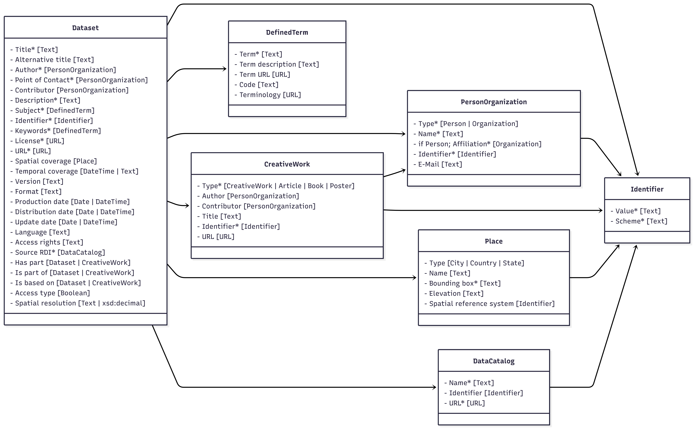

##  2. Publication Metadata Set
*Version 1.0.0*; published on 2025-12-22


/// caption
**Figure 1:** FAIRagros Publication Metadata Set types and their relations to each other. Mandatory properties of each type are marked with a “*”.
///

**Figure 1:** FAIRagros Publication Metadata Set types and their relations to each other. Mandatory properties of each type are marked with a “*”.

Cardinalities are defined in relation to their respective concepts.  
**Example:** A cardinality of “1” for a property does only apply, if an instance of its related concept exists. This doesn’t necessitate the existence of such an instance.

Types and properties from following namespaces are used:

- Schema.org: [https://schema.org](https://schema.org){:target="_blank"}
- DC Terms: [http://purl.org/dc/terms](http://purl.org/dc/terms){:target="_blank"}
- DCAT: [http://www.w3.org/ns/dcat#](http://www.w3.org/ns/dcat#){:target="_blank"}

**Acknowledgements:** Many model and design patterns for Schema.org types and properties were based on the [Science On Schema.Org (SOSO) Guidance Documents](https://github.com/ESIPFed/science-on-schema.org/tree/main).

Adam Shepherd, Matthew B. Jones, Stephen Richard, Nicholas Jarboe, Dave Vieglais, Douglas Fils, Ruth Duerr, Chantelle Verhey, Melinda Minch, Bryce Mecum, Nokome Bentley. (2023). Science-on-Schema.org v1.3.2. Zenodo. [https://doi.org/10.5281/zenodo.7884538](https://doi.org/10.5281/zenodo.7884538).

### 2.1 Dataset

**Definition:** “A body of structured information describing some topic(s) of interest.”

**Representation:**
```
{
	"@type": "https://schema.org/Dataset"
}
```

#### 2.1.1 Title
**Definition:** “The main title of the Dataset.” (Definition taken from Dataverse)  
**Cardinality:** 1  
**Range:** Text

**Representation:**
```
{
	"https://schema.org/name": "Example title"
}
```

#### 2.1.2 Alternative title
**Definition:** “Either 1) a title commonly used to refer to the Dataset or 2) an abbreviation of the main title.” (Definition taken from Dataverse)  
**Cardinality:** 0-n  
**Range:** Text

**Representation:**
```
{
	"https://schema.org/alternativeHeadline": "An alternative title"
}
```

#### 2.1.3 Author
**Definition:** “The entity, e.g. a person or organization, that created the Dataset.” (Definition taken from Dataverse)  
**Cardinality:** 1-n  
**Range:** Person/Organization

**Representation:**
```
{
  "https://schema.org/author": [
    {
      "@type": "https://schema.org/Person"
    }
  ]
}
```
/
```
{
  "https://schema.org/author": [
    {
      "@type": "https://schema.org/Organization"
    }
  ]
}
```

#### 2.1.4 Point of Contact
**Definition:** “The entity, e.g. a person or organization, that users of the Dataset can contact with questions.” (Definition taken from Dataverse)  
**Cardinality:** 1-n  
**Range:** Person/Organization  
**Comment:**  [Schema.org](http://schema.org){:target="_blank"} doesn’t offer a fitting property or type to express this role. The [https://schema.org/ContactPoint](https://schema.org/ContactPoint){:target="_blank"} type and its related [https://schema.org/contactPoint](https://schema.org/contactPoint){:target="_blank"} are meant to express a contact point for a person/organization, not to express a person/organization as a contact point, as it is defined in Dataverse. To still model this information, at least one person/organization related to a Dataset as an author or contributor, needs to be additionally typed by adding an [https://schema.org/additionalType](https://schema.org/additionalType){:target="_blank"} property with the value “Contact Point” to the person/organization metadata object.

**Representation:**
```
{
	"@type":"https://schema.org/Person",
	"https://schema.org/additionalType": "Contact Point"
}
```
/
```
{
  "@type": "https://schema.org/Organization",
  "https://schema.org/additionalType": "Contact Point"
}
```

#### 2.1.5 Contributor
**Definition:** “The entity, such as a person or organization, responsible for collecting, managing, or otherwise contributing to the development of the Dataset.” (Definition taken from Dataverse)  
**Cardinality:** 0-n  
**Range:** Person/Organization

**Representation:**
```
{
  "https://schema.org/contributor": {
    "@type": "https://schema.org/Person"
  }
}
```
/
```
{
  "https://schema.org/contributor": {
    "@type": "https://schema.org/Organization"
  }
}
```

#### 2.1.6 Description
**Definition:** “A summary describing the purpose, nature, and scope of the Dataset.” (Definition taken from Dataverse)  
**Cardinality:** 1-n  
**Range:** Text

**Representation:**
```
{
  "https://schema.org/description": "An example description"
}
```

#### 2.1.7 Subject
**Definition:** “The area of study relevant to the Dataset.” (Definition taken from Dataverse)  
**Cardinality:** 1-n  
**Range:** DefinedTerm  
**Comment:** Dataverse uses a fixed list of subjects it accepts. For the agricultural domain, everything would fall under “Agricultural Sciences”. To express this information use [https://schema.org/about](https://schema.org/about){:target="_blank"}, link it to a [https://schema.org/DefinedTerm](https://schema.org/DefinedTerm){:target="_blank"} instance and use AGROVOCs “agricultural sciences” concept ([http://aims.fao.org/aos/agrovoc/c_49876](http://aims.fao.org/aos/agrovoc/c_49876){:target="_blank"}) for its value.

**Representation:**
```
{
  "https://schema.org/about": {
    "@type": "https://schema.org/DefinedTerm",
    "https://schema.org/name": "agricultural sciences",
		"https://schema.org/description": "Agricultural science is a broad multidisciplinary field of biology that encompasses the parts of exact, natural, economic and social sciences that are used in the practice and understanding of agriculture.",
		"https://schema.org/url":"http://aims.fao.org/aos/agrovoc/c_49876",
		"https://schema.org/termCode":"c_49876",
		"https://schema.org/inDefinedTermSet": "http://aims.fao.org/aos/agrovoc"
  }
}
```

#### 2.1.8 Identifier
**Definition:** “A unique identifier for the Dataset (e.g. producer's or repository's identifier).” (changed from DataVerse “otherId” definition)  
**Cardinality:** 1-n  
**Range:** Identifier  
**Comment:** This property is used to store the identifiers from original data sources such as Research Data Infrastructures. Compared to Dataverses “otherId” property, it is mandatory for the FAIRagro Publication Metadata Set.

**Representation:**
```
{
  "https://schema.org/identifier": {
    "@type": "https://schema.org/PropertyValue"
  }
}
```

#### 2.1.9 Keyword(s)
**Definition:** “A key term that describes an important aspect of the Dataset and information about any controlled vocabulary used.” (Definition taken from Dataverse)  
**Cardinality:** 1-n  
**Range:** DefinedTerm

**Representation:**
```
{
  "https://schema.org/keywords": {
    "@type": "https://schema.org/DefinedTerm"
  }
}
```

#### 2.1.10 License
**Definition:** “License defining the rights to (re-)use the dataset.” (Definition taken from Dataverse)  
**Cardinality:** 1  
**Range:** URL  
**Comment:** If possible, the “License” property should link to a record from the SPDX license list ([https://spdx.org/licenses](https://spdx.org/licenses/){:target="_blank"}), a record from the Creative Commons license list ([https://creativecommons.org/share-your-work/cclicenses](https://creativecommons.org/share-your-work/cclicenses/){:target="_blank"}) or to a separate ODRL compliant file.

**Representation:**
```
{
  "https://schema.org/license": "https://spdx.org/licenses/CC-BY-4.0.html"
}
```

#### 2.1.11 URL
**Definition:** “An URL where one can view or access the data in the Dataset, e.g. the webpage of a Research Data Infrastructure.” (changed from DataVerse "alternativeURL")  
**Cardinality:** 1  
**Range:** URL

**Representation:**
```
{
  "https://schema.org/url": "https://www.openagrar.de/receive/openagrar_mods_00092233"
}
```

#### 2.1.12 Spatial coverage
**Definition:** “The spatialCoverage of a Dataset indicates the place(s) which are the focus of the content.” (Definition changed from Schema.org "[https://schema.org/spatialCoverage](https://schema.org/spatialCoverage){:target="_blank"}")  
**Cardinality:** 0-n  
**Range:** Place

**Representation:**
```
{
  "https://schema.org/spatialCoverage": {
    "@type": "https://schema.org/Place"
  }
}
```

#### 2.1.13 Temporal coverage
**Definition:** “The temporalCoverage of a Dataset indicates the period that the content applies to, i.e. that it describes, either as a DateTime or as a textual string indicating a time period in [ISO 8601 time interval format](https://en.wikipedia.org/wiki/ISO_8601#Time_intervals){:target="_blank"}. Open-ended date ranges can be written with ".." in place of the end date. For example, "2015-11/.." indicates a range beginning in November 2015 and with no specified final date.” (Definition changed from [https://schema.org/temporalCoverage](https://schema.org/temporalCoverage){:target="_blank"})  
**Cardinality:** 0-1  
**Range:** Text / DateTime

**Representation:**
```
{
  "https://schema.org/temporalCoverage": "2022 - 2023"
}
```

#### 2.1.14 Version
**Definition:** “The version number of the dataset.”  
**Cardinality:** 0-1  
**Range:** Text

**Representation:**
```
{
  "https://schema.org/version": "v1.0"
}
```

#### 2.1.15 Format
**Definition:** “The file format(s) of the dataset.”  
**Cardinality:** 0-n  
**Range:** Text

**Representation:**
```
{
  "https://schema.org/encodingFormat": "application/zip"
}
```

#### 2.1.16 Production date
**Definition:** “The date when the data were produced (not distributed, published, or archived).” (Definition taken from Dataverse)  
**Cardinality:** 0-1  
**Range:** Date or DateTime (ISO 8601)

**Representation:**
```
{
  "https://schema.org/dateCreated": "2024-11-19"
}
```

#### 2.1.17 Distribution date
**Definition:** “The date when the Dataset was made available for distribution/presentation.” (Definition taken from Dataverse)  
**Cardinality:** 0-1  
**Range:** Date or DateTime (ISO 8601)

**Representation:**
```
{
  "https://schema.org/datePublished": "2025-11-19"
}
```

#### 2.1.18 Update date
**Definition:** “The date on which the Dataset was most recently modified or when the item's entry was modified.” (Definition changed from [https://schema.org/dateModified](https://schema.org/dateModified){:target="_blank"})  
**Cardinality:** 0-1  
**Range:** Date or DateTime (ISO 8601)

**Representation:**
```
{
  "https://schema.org/dateModified": "2025-11-19"
}
```

#### 2.1.19 Language
**Definition:** “A language that the Dataset's files is written in.” (Definition taken from Dataverse)  
**Cardinality:** 0-n  
**Range:** Text  
**Comment:** Use language codes from [https://www.rfc-editor.org/info/bcp47](https://www.rfc-editor.org/info/bcp47){:target="_blank"}.

**Representation:**
```
{
  "https://schema.org/inLanguage": "de-DE"
}
```

#### 2.1.20 Access rights
**Definition:** “Information about who accesses the resource or an indication of its security status.” (taken from [http://purl.org/dc/terms/accessRights](http://purl.org/dc/terms/accessRights){:target="_blank"})  
**Cardinality:** 0-n  
**Range:** Text  
**Comment:** Values for access rights statements can e.g. be “restricted”, or “internal” or can come from a controlled vocabulary.

**Representation:**
```
{
	"http://purl.org/dc/terms/accessRights":"internal"
}
```

#### 2.1.21 Source RDI
**Definition:** “The original Research Data Infrastructure that the dataset was published by.”  
**Cardinality:** 1  
**Range:** DataCatalog

**Representation:**
```
{
  "https://schema.org/includedInDataCatalog": {
    "@type": "https://schema.org/DataCatalog"
  }
}
```

#### 2.1.22 Has part
**Definition:** “Indicates a Dataset or CreativeWork that is part of this item.” (Definition changed from [https://schema.org/hasPart](https://schema.org/hasPart){:target="_blank"})  
**Cardinality:** 0-n  
**Range:** Dataset/CreativeWork

**Representation:**
```
{
  "https://schema.org/hasPart": {
    "@type": "https://schema.org/Dataset"
  }
}
```
/
```
{
  "https://schema.org/hasPart": {
    "@type": "https://schema.org/CreativeWork"
  }
}
```

#### 2.1.23 Is part of
**Definition:** “Indicates a Dataset or CreativeWork that this item.” (Definition changed from [https://schema.org/isPartOf](https://schema.org/isPartOf){:target="_blank"})  
**Cardinality:** 0-n  
**Range:** Dataset/CreativeWork

**Representation:**
```
{
  "https://schema.org/isPartOf": {
    "@type": "https://schema.org/Dataset"
  }
}
```
/
```
{
  "https://schema.org/isPartOf": {
    "@type": "https://schema.org/CreativeWork"
  }
}
```

#### 2.1.24 Is based on
**Definition:** “A resource from which this Dataset is derived or from which it is a modification or adaptation.” (Definition changed from [https://schema.org/isBasedOn](https://schema.org/isBasedOn){:target="_blank"})  
**Cardinality:** 0-n  
**Range:** Dataset/CreativeWork

**Representation:**
```
{
  "https://schema.org/isBasedOn": {
    "@type": "https://schema.org/Dataset"
  }
}
```
/
```
{
  "https://schema.org/isBasedOn": {
    "@type": "https://schema.org/CreativeWork"
  }
}
```

#### 2.1.25 Access type
**Definition:** “A flag to signal that the item, event, or place is accessible for free.” (Definition taken from [https://schema.org/isAccessibleForFree](https://schema.org/isAccessibleForFree){:target="_blank"})  
**Cardinality:** 0-1  
**Range:** Boolean

**Representation:**
```
{
  "https://schema.org/isAccessibleForFree": "True"
}
```
/
```
{
  "https://schema.org/isAccessibleForFree": "False"
}
```

#### 2.1.26 Spatial resolution
**Definition:** “Minimum spatial separation resolvable in a dataset, measured in meters.” (Definition taken from DCAT)  
**Cardinality:** 0-1  
**Range:** Text / [xsd:decimal](https://www.w3.org/TR/xmlschema11-2/#decimal){:target="_blank"}

**Representation:**
```
{
	"https://www.w3.org/ns/dcat#spatialResolutionInMeters":"100.5"
}
```

### 2.2 Person/Organization
**Person definition:** “A person (alive, dead, undead, or fictional).” (Definition taken from [https://schema.org/Person](https://schema.org/Person){:target="_blank"})

**Organization definition:** “An organization such as a school, NGO, corporation, club, etc..” (Definition taken from [https://schema.org/Organization](https://schema.org/Organization){:target="_blank"})

#### 2.2.1 Type
**Definition:** “Defines if an entity is a person or an organization.”  
**Cardinality:** 1  
**Range:**[https://schema.org/Person](https://schema.org/Person){:target="_blank"} / [https://schema.org/Organization](https://schema.org/Organization){:target="_blank"}  
**Comment**: Choosing the correct type depends on the property it is used for as a value. For the “author” property, it will most likely be a [https://schema.org/Person](https://schema.org/Person){:target="_blank"}, whereas it will most likely be a [https://schema.org/Organization](https://schema.org/Organization){:target="_blank"} as a value for the “affiliation” property.

**Representation:**
```
{
  "@type": "https://schema.org/Person"
}
```
/
```
{
  "@type": "https://schema.org/Organization"
}
```

#### 2.2.2 Name
**Definition:** “The name of the person or the organization.” (Definition changed from Dataverse)  
**Cardinality:** 1  
**Range:** Text

**Representation:**
```
{
  "https://schema.org/name": "Example name"
}
```
#### 2.2.3 Affiliation (Person)
**Definition:** “The name of the organization the person is  affiliated with, e.g. an organization's name.” (Definition changed from Dataverse)  
**Cardinality:** 1  
**Range:** Organization

**Representation:**
```
{
  "https://schema.org/affiliation": {
    "@type": "https://schema.org/Organization"
  }
}
```

#### 2.2.4 Identifier
**Definition:** “Uniquely identifies a person/organization when paired with an identifier type.” (changed from DataVerse)  
**Cardinality:** 1  
**Range:** Identifier

**Representation:**
```
{
  "https://schema.org/identifier": {
    "@type": "https://schema.org/PropertyValue"
  }
}
```

#### 2.2.4 E-Mail
**Definition:** “A person/organization contact email address.” (Definition changed from Dataverse)  
**Cardinality:** 0-1  
**Range:** Text

**Representation:**
```
{
  "https://schema.org/email": "email@example.org"
}
```

### 2.3 Identifier
**Definition:** “A unique identifier of the an entity (e.g. a Dataset, a Person, an Organization).” (Definition  changed from [https://www.w3.org/TR/vocab-dcat-3/#Property:resource_identifier](https://www.w3.org/TR/vocab-dcat-3/#Property:resource_identifier){:target="_blank"})

**Representation:**
```
{
  "@type": "https://schema.org/PropertyValue"
}
```
#### 2.3.1 Value
**Definition:** “The value of an identifier.”  
**Cardinality:** 1  
**Range:** Text

**Representation:**
```
{
  "https://schema.org/value": "10.1000/182"
}
```

#### 2.3.2 Scheme
**Definition:** “The type of identifier (e.g. DOI, ORCID).” (Definition  changed from Dataverse)  
**Cardinality:** 1  
**Range:** Text / URL  
**Comment:** Use [https://schema.org/propertyID](https://schema.org/propertyID){:target="_blank"} to preferably point to a record in an identifier registry (e.g. [https://registry.identifiers.org/registry/orcid](https://registry.identifiers.org/registry/orcid){:target="_blank"}), the official namespace of an identifier (e.g. [https://orcid.org/](https://orcid.org/){:target="_blank"}) or provide a string value (e.g. “orcid”).

**Representation:**
```
{
  "https://schema.org/propertyID": "https://registry.identifiers.org/registry/orcid"
}
```

### 2.4 DefinedTerm
**Definition:** “A word, name, acronym, phrase, etc. with a formal definition. Often used in the context of category or subject classification, glossaries or dictionaries, product or creative work types, etc..” (Definition taken from [https://schema.org/DefinedTerm](https://schema.org/DefinedTerm){:target="_blank"})

**Representation:**
```
{
"@type": "https://schema.org/DefinedTerm"
}
```

#### 2.4.1 Term
**Definition:** “A key term that describes important aspects of the Dataset.” (Definition taken from Dataverse)  
**Cardinality:** 1  
**Range:** Text

**Representation:**
```
{
  "https://schema.org/name": "An example defined term"
}
```

#### 2.4.2 Term description
**Definition:** “A description/definition of the DefinedTerm.” (Definition changed from [https://schema.org/description](https://schema.org/description){:target="_blank"})  
**Cardinality:** 0-1  
**Range:** Text

**Representation:**
```
{
  "https://schema.org/description": "Agriculture or farming is the cultivation and breeding of animals, plants and fungi for food, fiber, biofuel, medicinal plants and other products used to sustain and enhance human life."
}
```

#### 2.4.3 Term URL
**Definition:** “A URL that points to the web presence of the DefinedTerm.” (Definition changed from Dataverse)  
**Cardinality:** 0-1  
**Range:** Text

**Representation:**
```
{
  "https://schema.org/url": "http://aims.fao.org/aos/agrovoc/c_203"
}
```

#### 2.4.4 Code
**Definition:** “A code that identifies a term within a terminology.” (Definition changed from [https://schema.org/termCode](https://schema.org/termCode){:target="_blank"})  
**Cardinality:** 0-1  
**Range:** Text

**Representation:**
```
{
  "https://schema.org/termCode": "c_203"
}
```

#### 2.4.5 Terminology
**Definition:** “The controlled vocabulary used for the keyword term (e.g. AGROVOC, GEMET).” (Definition changed from Dataverse)  
**Cardinality:** 0-1  
**Range:** URL

**Representation:**
```
{
  "https://schema.org/inDefinedTermSet": "http://aims.fao.org/aos/agrovoc"
}
```

### 2.5 DataCatalog
**Definition:** “A collection of datasets, e.g. a Research Data Infrastructure.” (Definition changed from [https://schema.org/DataCatalog](https://schema.org/DataCatalog){:target="_blank"})

**Representation:**
```
{
  "@type": "https://schema.org/DataCatalog"
}
```

#### 2.5.1 Name
**Definition:** “The name of a Research Data Infrastructure/DataCatalog.”  
**Cardinality:** 1  
**Range:** Text

**Representation:**
```
{
  "https://schema.org/name": "OpenAgrar"
}
```

#### 2.5.2 Identifier
**Definition:** “The Identifier of a Research Data Infrastructure/DataCatalog.”  
**Cardinality:** 0-1  
**Range:** Identifier

**Representation:**
```
{
  "https://schema.org/identifier": {
    "@type": "https://schema.org/PropertyValue"
  }
}
```

#### 2.5.3 URL
**Definition:** “The URL of a Research Data Infrastructure/DataCatalog.”  
**Cardinality:** 1  
**Range:** URL

**Representation:**
```
{
  "https://schema.org/url": "https://www.openagrar.de/"
}
```

### 2.6 CreativeWork
**Definition:** “The most generic kind of creative work, including books, movies, photographs, software programs, etc..” (Definition taken from [https://schema.org/CreativeWork](https://schema.org/CreativeWork){:target="_blank"})

#### 2.6.1 Type
**Definition:** “The specific type of a creative work (e.g. an article, book).”  
**Cardinality:** 1  
**Range:** [https://schema.org/CreativeWork](https://schema.org/CreativeWork){:target="_blank"}; [https://schema.org/Article](https://schema.org/Article){:target="_blank"}; [https://schema.org/Book](https://schema.org/Book){:target="_blank"}; [https://schema.org/Poster](https://schema.org/Poster){:target="_blank"}  
**Comment:** Dataverse does not allow for the typisation of a related publication via a property, but [Schema.org](http://schema.org){:target="_blank"} does. [Schema.org](http://schema.org){:target="_blank"} offers different subtypes of [https://schema.org/CreativeWork](https://schema.org/CreativeWork){:target="_blank"}. To guarantee consistent mapping to the correct fields in Dataverse this modeling via choosing a fitting type for the CreativeWork object in [Schema.org](http://schema.org){:target="_blank"} is necessary.

**Representation:**
```
{
  "@type": "https://schema.org/CreativeWork"
}
```
/
```
{
  "@type": "https://schema.org/Article"
}
```
/
```
{
  "@type": "https://schema.org/Book"
}
```
/
```
{
  "@type": "https://schema.org/Poster"
}
```

#### 2.6.2 Author
**Definition:** “The entity, e.g. a person or organization, that created the CreativeWork.” (Definition changed from Dataverse)  
**Cardinality:** 0-n  
**Range:** Person/Organization

**Representation:**
```
{
  "https://schema.org/author": {
    "@type": "https://schema.org/Person"
  }
}
```
/
```
{
  "https://schema.org/author": {
    "@type": "https://schema.org/Organization"
  }
}
```

#### 2.6.3 Contributor
**Definition:** “The entity, such as a person or organization, responsible for collecting, managing, or otherwise contributing to the development of the CreativeWork.” (Definition changed from Dataverse)  
**Cardinality:** 0-n  
**Range:** Person/Organization

**Representation:**
```
{
  "https://schema.org/contributor": {
    "@type": "https://schema.org/Person"
  }
}
```
/
```
{
  "https://schema.org/contributor": {
    "@type": "https://schema.org/Organization"
  }
}
```

#### 2.6.4 Title
**Definition:** “The main title of a creative work.”  
**Cardinality:** 0-1  
**Range:** Text

**Representation:**
```
{
  "https://schema.org/name": "Example title"
}
```

#### 2.6.5 Identifier
**Definition:** “An identifier of a creative work.”  
**Cardinality:** 1  
**Range:** Text

**Representation:**
```
{
  "https://schema.org/identifier": {
    "@type": "https://schema.org/PropertyValue"
  }
}
```

#### 2.6.6 URL
**Definition:** “An URL of a creative work.”  
**Cardinality:** 0-1  
**Range:** Text

**Representation:**
```
{
  "https://schema.org/url": "https://zenodo.org/records/7528172"
}
```

### 2.7 Place
**Definition:** “Entities that have a somewhat fixed, physical extension.” (Definition taken from [https://schema.org/Place](https://schema.org/Place){:target="_blank"})

#### 2.7.1 Type
**Definition:** “The specific type of a place (e.g. a city, country, state).”  
**Cardinality:** 0-1  
**Range:** [https://schema.org/City](https://schema.org/City){:target="_blank"}; [https://schema.org/Country](https://schema.org/Country){:target="_blank"}; [https://schema.org/State](https://schema.org/State){:target="_blank"}  
**Comment:** Dataverse doesn’t allow a typisation of different places, but [Schema.org](http://schema.org){:target="_blank"} does.  To guarantee consistent mapping to the correct fields in Dataverse (City, Country, State) this modeling via choosing a fitting type for the Place object in [Schema.org](http://schema.org){:target="_blank"} is necessary.

**Representation:**
```
{
  "@type": "https://schema.org/City"
}
```
/
```
{

"@type": "https://schema.org/Country"

}
```
/
```
{
  "@type": "https://schema.org/State"
}
```

#### 2.7.2 Name
**Definition:** “The name of a place.”  
**Cardinality:** 0-1  
**Range:** Text

**Representation:**
```
{
  "https://schema.org/name": "Germany"
}
```

#### 2.7.3 Bounding box
**Definition:** “A box is the area enclosed by the rectangle formed by two points. The first point is the lower corner, the second point is the upper corner. A box is expressed as two points separated by a space character.” (Definition taken from [https://schema.org/box](https://schema.org/box){:target="_blank"})  
**Cardinality:** 1  
**Range:** Text  
**Comment:** [Schema.org](http://schema.org){:target="_blank"} uses the [https://schema.org/GeoShape](https://schema.org/GeoShape){:target="_blank"} type to attach geospatial information to a Place object, via the [https://schema.org/geo](https://schema.org/geo){:target="_blank"} property. A bounding box can then be attached to this object.

**Representation:**
```
{
  "https://schema.org/geo": {
    "@type": "https://schema.org/GeoShape",
    "https://schema.org/box": "38.920952 -94.645443 38.951797 -94.680439"
  }
}
```

#### 2.7.4 Elevation
**Definition:** “Altitude, like elevation, is the distance above sea level.”  
**Cardinality:** 0-1  
**Range:** Text

**Representation:**
```
{
  "https://schema.org/additionalProperty": {
    "@type": "https://schema.org/PropertyValue",
    "https://schema.org/name": "elevation",
		"https://schema.org/description":"Altitude, like elevation, is the distance above sea level.",
    "https://schema.org/propertyID": "http://aims.fao.org/aos/agrovoc/c_316",
    "https://schema.org/unitText": "meter",
    "https://schema.org/unitCode": "http://purl.obolibrary.org/obo/UO_0000008",
    "https://schema.org/value": "65"
  }
}
```

#### 2.7.5 Spatial reference system
**Definition:** “The spatial reference system used for the measured geocoordinates.”  
**Cardinality:** 0-1  
**Range:** Identifier  
**Comment:** For the value of a spatial reference system please use EPSG codes where possible.
**Representation:**
```
{
  "https://schema.org/additionalProperty": {
    "@type": "https://schema.org/PropertyValue",
    "https://schema.org/name": "spatial reference system",
		"https://schema.org/description":"The spatial reference system used for the measured geocoordinates.",
    "https://schema.org/propertyID": "https://www.commoncoreontologies.org/ont00000275",
    "https://schema.org/value": "EPSG:4326"
  }
}
```